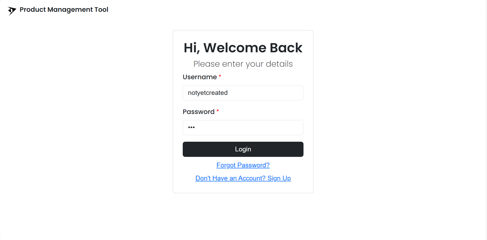
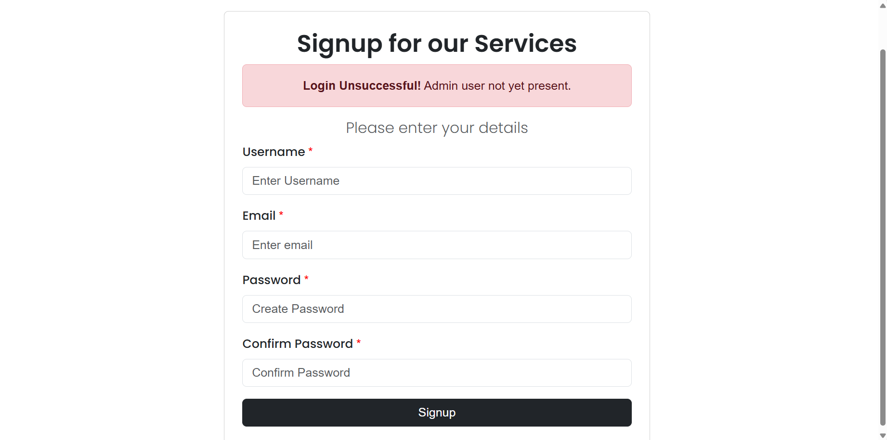
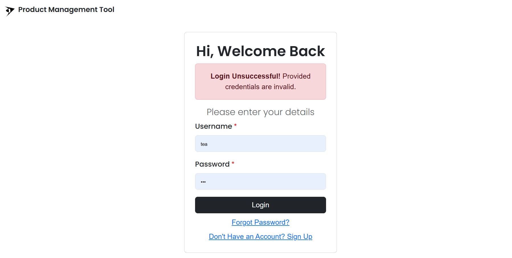
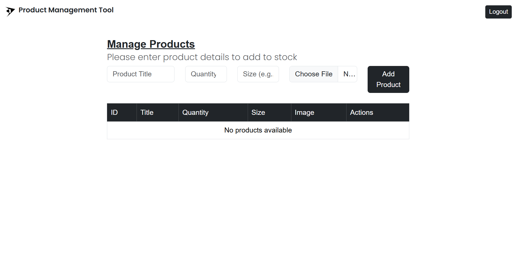
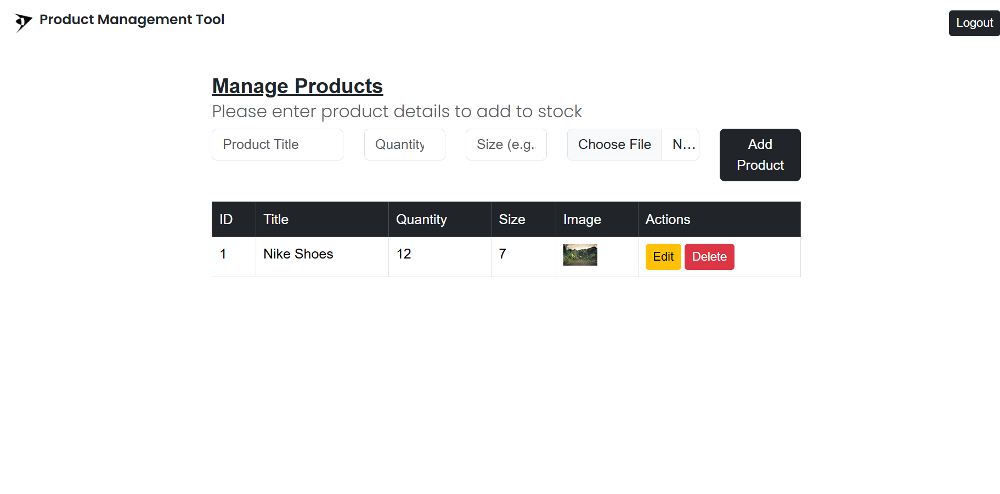

### Description/Features:
##
* Product Search V3: Admin product/inventory management application that requires admin users to login / signup. Only one admin account is permissible. Users are able to add, delete and edit products.
###
### Technology/Tools:
##
* Tools, Technologies Used: Java, Servlets, Tomcat Server, MVC, Hibernate, PostgreSQL, HTML, CSS, Java/Jakarta Server Pages (JSPs) Bootstrap.
###
### Screenshots:

###

###

###

###
